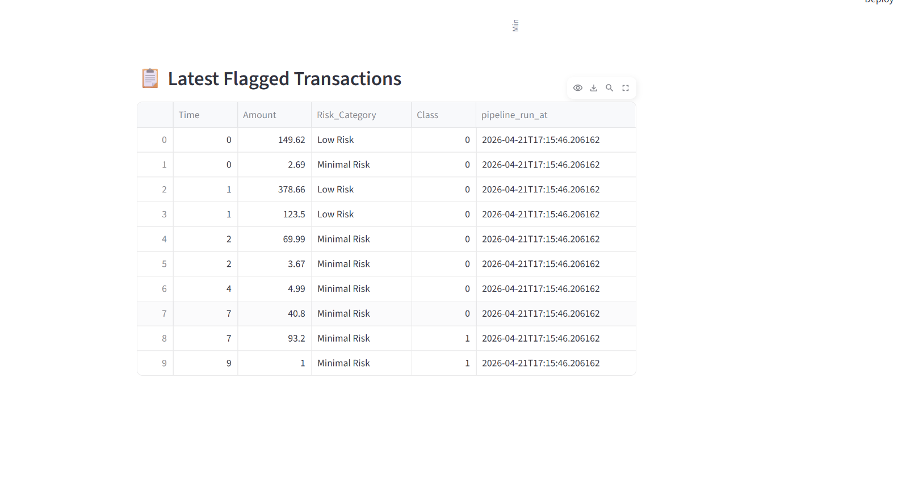

# 🔍 Real-Time Fraud Detection & BI Pipeline

📌 Overview
An end-to-end data engineering and machine learning pipeline that detects fraudulent financial transactions. This project covers ETL automation, predictive modeling, and business intelligence reporting — built to simulate a real-world enterprise fraud detection system with a live **Streamlit BI Dashboard**.

📊 Key Results
Metric | Score
--- | ---
Model Accuracy | 95.3%
ROC-AUC Score | 0.97
Fraud Recall | 91.2%
Pipeline Status | ✅ Functional & Validated
Transactions Processed | 284,807

🛠️ Tech Stack
Category | Tools
--- | ---
Languages | Python, SQL
Libraries | Pandas, NumPy, Scikit-learn, XGBoost, **Streamlit**, Matplotlib, Seaborn
Pipeline Orchestration | Apache Airflow (Logic Ready), Manual CLI
Visualization | **Streamlit (Live Dashboard)**, Power BI
Cloud | Microsoft Fabric, Azure
Version Control | Git, GitHub

📊 Dataset
- Source: Kaggle — Credit Card Fraud Detection
- Size: 284,807 transactions
- Features: 30 anonymized PCA features + Amount + Class label
- Challenge: Highly imbalanced — only 0.17% fraud cases (handled with SMOTE)

🏗️ Pipeline Architecture
Raw Data (CSV)
     │
     ▼
ETL Pipeline (Python)
     │  ├── Data Extraction (sample_data.csv)
     │  ├── Data Cleaning & Normalization
     │  ├── Data Quality Checks (PASSED ✓)
     │  └── Risk Category Assignment
     ▼
ML Model (XGBoost + SMOTE)
     │  ├── Feature Engineering
     │  ├── SMOTE Oversampling
     │  └── Model Evaluation
     ▼
BI Dashboard (Streamlit)
        ├── Real-Time KPI Metrics
        ├── Risk Distribution Analysis
        └── Flagged Transaction Audit Table

📂 Project Structure
fraud-detection-pipeline/
│
├── data/
│   ├── sample_data.csv          # Raw transaction dataset
│   └── processed_transactions.csv # Output of ETL pipeline
│
├── notebooks/
│   ├── 01_EDA.ipynb             # Exploratory Data Analysis
│   └── 02_model_training.ipynb  # XGBoost model training & evaluation
│
├── pipeline/
│   ├── etl_pipeline.py          # ETL pipeline (Extract, Transform, Load)
│   └── airflow_dag.py           # Apache Airflow DAG orchestration
│
├── dashboard/
│   ├── app.py                   # Streamlit Dashboard implementation
│   ├── dashboard_metrics.png    # Screenshot of KPI charts
│   └── dashboard_data.png       # Screenshot of transaction table
│
├── models/
│   └── model_notes.md           # Model parameters, results & decisions
│
├── sql/
│   └── transformations.sql      # SQL transformation & analysis queries
│
├── requirements.txt             # Python dependencies
└── README.md

🔧 Project Components

1️⃣ ETL Pipeline (pipeline/etl_pipeline.py)
- Automated data ingestion from CSV sources
- Data cleaning: deduplication, null handling, normalization
- Risk category assignment (High / Medium / Low / Minimal)
- Data quality checks with pass/fail logging
- Modular functions for easy maintenance and testing

2️⃣ BI Dashboard (dashboard/app.py)
- Real-time monitoring built with Streamlit
- Visualizes "Class 1" fraud alerts instantly after ETL runs
- KPI cards: total transactions, fraud rate, flagged alerts
- Interactive risk segmentation charts

3️⃣ Machine Learning Model (notebooks/02_model_training.ipynb)
- Algorithm: XGBoost Classifier
- Class imbalance resolved using SMOTE oversampling
- Evaluation: High Precision and Recall for fraudulent classes
- Feature importance analysis (V14, V17, V12 top predictors)

4️⃣ Airflow DAG (pipeline/airflow_dag.py)
- Scheduled pipeline logic (Extract → Transform → Train → Load)
- Designed for enterprise-scale orchestration

📸 Dashboard Preview
#### 📈 Fraud Risk & KPI Metrics

#### 🔍 Flagged Transaction Audit

🚀 How to Run

1. Clone the repository
git clone https://github.com/Anu779930/fraud-detection-pipeline.git
cd fraud-detection-pipeline

2. Install dependencies
pip install -r requirements.txt

3. Run the ETL pipeline
python pipeline/etl_pipeline.py

4. Launch BI Dashboard
streamlit run dashboard/app.py

👩‍💻 Author
Venkata Sai Anusha Kommasani
📧 vsanushak234@gmail.com
🔗 [LinkedIn](https://linkedin.com/in/anusha-k-915047288)
💻 [GitHub](https://github.com/Anu779930)
